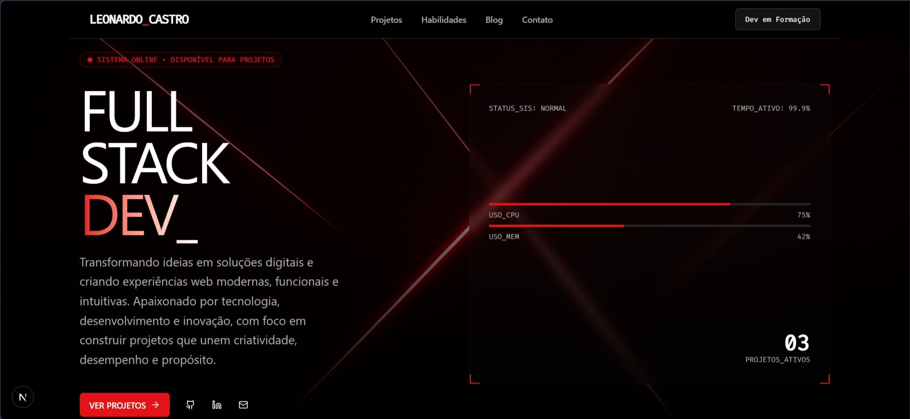

# 🚀 Devstarter — Portfólio de Leonardo Castro

> Portfólio profissional desenvolvido para apresentar minha trajetória, habilidades, projetos e experiências na área de desenvolvimento de software.

---

## 📌 Sobre o projeto

O **Devstarter** é o portfólio pessoal de **Leonardo Castro**, estudante de **Análise e Desenvolvimento de Sistemas** e desenvolvedor em formação, com foco em desenvolvimento web e construção de soluções modernas.

O projeto foi desenvolvido com uma abordagem moderna e responsiva, priorizando **performance, organização, acessibilidade e experiência do usuário**.

O portfólio apresenta:

* 👨‍💻 Perfil profissional
* 🛠️ Habilidades e competências técnicas
* 📂 Projetos desenvolvidos
* 🎓 Formação acadêmica
* 🔗 Links para redes profissionais
* 📩 Formulário de contato funcional
* ✉️ Envio de mensagens diretamente para meu e-mail
* 📱 Interface responsiva para diferentes dispositivos
* ⚡ Componentes reutilizáveis e arquitetura moderna
* 🔐 Integração com serviços externos por meio de API

---

## 🧑‍💻 Sobre mim

Sou estudante de **Análise e Desenvolvimento de Sistemas**, em constante evolução na área de tecnologia e desenvolvimento de software.

Tenho interesse especialmente em **desenvolvimento web, backend, frontend e integração de sistemas**, buscando transformar conhecimento técnico em projetos funcionais e soluções reais.

Meu objetivo é conquistar uma oportunidade profissional na área de desenvolvimento, onde possa aplicar meus conhecimentos, aprender com profissionais experientes e contribuir para projetos relevantes.

---

## 🛠️ Tecnologias utilizadas

### Frontend

* **Next.js**
* **React**
* **TypeScript**
* **Tailwind CSS**
* **shadcn/ui**

### Backend e APIs

* **Next.js API Routes**
* **Resend API**
* **Integração com serviços externos**

### Ferramentas e desenvolvimento

* **Git**
* **GitHub**
* **npm**
* **ESLint**

---

## 📩 Sistema de contato

Uma das funcionalidades implementadas no portfólio é o **formulário de contato**, permitindo que visitantes enviem mensagens diretamente pelo site.

Para realizar o envio dos e-mails, foi utilizada a **Resend API**, responsável pela comunicação e entrega das mensagens.

### Fluxo do formulário

```text
Visitante
   │
   ▼
Formulário de contato
   │
   ▼
API do Next.js
   │
   ▼
Resend API
   │
   ▼
E-mail de destino
```

A integração permite que as informações preenchidas no formulário sejam processadas pelo backend e encaminhadas diretamente para meu e-mail.

### 🔐 Segurança

As credenciais da API não ficam expostas no frontend. A chave de acesso do Resend é armazenada utilizando **variáveis de ambiente**, evitando que informações sensíveis sejam disponibilizadas publicamente no código-fonte.

Exemplo:

```env
RESEND_API_KEY=sua_chave_api
```

> **Importante:** nunca publique sua chave real da Resend no GitHub ou diretamente no código do projeto.

---

## 🏗️ Arquitetura

O projeto utiliza uma estrutura baseada no ecossistema **Next.js**, com componentes reutilizáveis e uma abordagem moderna para construção da interface.

A utilização de **TypeScript** contribui para maior segurança e previsibilidade durante o desenvolvimento, enquanto o **Tailwind CSS** facilita a criação de uma interface responsiva e consistente.

Os componentes de interface são construídos utilizando **shadcn/ui**, permitindo maior flexibilidade e personalização do design.

A aplicação também possui integração com a **Resend API**, utilizada para implementar o sistema de envio de mensagens do formulário de contato.

---

## 🚀 Como executar o projeto

### 1. Clone o repositório

```bash
git clone https://github.com/SEU-USUARIO/SEU-REPOSITORIO.git
```

### 2. Acesse a pasta

```bash
cd SEU-REPOSITORIO
```

### 3. Instale as dependências

```bash
npm install
```

### 4. Configure as variáveis de ambiente

Crie um arquivo `.env.local` na raiz do projeto:

```env
RESEND_API_KEY=sua_chave_api
```

Substitua `sua_chave_api` pela sua chave da Resend.

### 5. Execute o servidor de desenvolvimento

```bash
npm run dev
```

### 6. Acesse no navegador

O projeto estará disponível em:

```text
http://localhost:3003
```

---

## 📦 Scripts disponíveis

| Comando         | Descrição                            |
| --------------- | ------------------------------------ |
| `npm install`   | Instala as dependências do projeto   |
| `npm run dev`   | Inicia o servidor de desenvolvimento |
| `npm run build` | Gera a versão de produção            |
| `npm start`     | Inicia a aplicação em produção       |
| `npm run lint`  | Verifica problemas de linting        |

---

## 📱 Responsividade

O projeto foi desenvolvido para oferecer uma boa experiência em diferentes tamanhos de tela:

* 🖥️ Desktop
* 💻 Notebook
* 📱 Smartphones
* 📲 Tablets

A interface utiliza uma abordagem responsiva para adaptar seus componentes e conteúdos aos diferentes dispositivos.

---

## 🎨 Design

A interface foi projetada com foco em:

* Design moderno e minimalista
* Hierarquia visual
* Navegação intuitiva
* Responsividade
* Componentização
* Experiência do usuário
* Identidade visual profissional

---

## 📸 Preview



---

## 📚 Origem do projeto

O projeto teve como ponto de partida o template **Devstarter**, desenvolvido pela **Zippystarter**, utilizando Next.js e shadcn/ui.

A partir da estrutura inicial, o projeto foi **adaptado e personalizado** para funcionar como meu portfólio profissional, incluindo identidade visual, conteúdo, projetos, informações profissionais, sistema de contato e integração com a Resend API.

* [Zippystarter](https://zippystarter.com)
* [Next.js](https://nextjs.org)
* [shadcn/ui](https://ui.shadcn.com)
* [Resend](https://resend.com)

---

## 👨‍💻 Autor

**Leonardo Castro**

Estudante de Análise e Desenvolvimento de Sistemas | Desenvolvedor em formação

### 🌐 Conecte-se comigo

* **GitHub:** `Leo-CastroDEV`
* **LinkedIn:** Leonardo Castro
* **Portfólio:** disponível neste projeto

---

## 📄 Licença

Este projeto foi desenvolvido para fins de **portfólio e apresentação profissional**.

O template original pertence aos seus respectivos autores e foi utilizado como base para desenvolvimento e personalização deste projeto.
